> 文章来自于博客：https://blog.csdn.net/get_set/article/details/79466657
>
> 如果有兴趣阅读更加详细的内容，请移步到上面的博客

### 1. 响应式编程之道
#### 1.1 什么是响应式编程

> https://blog.csdn.net/get_set/article/details/79455258

##### 1.1.1 变化传递 (propagation of change)
##### 1.1.2 数据流 (data stream)
##### 1.1.3 声明式(declarative)
##### 1.1.4 总结
  响应式编程（reactive programming）是一种基于数据流（data stream）和变化传递（propagation of change）的声明式（declarative）的编程范式。

#### 1.2 响应式流

> https://blog.csdn.net/get_set/article/details/79466402

为什么不用Java Stream来进行数据流的操作？ 原因在于，若将其用于响应式编程中，是有局限性的。比如如下两个需要面对的问题： 

1. Web 应用具有I/O密集的特点，I/O阻塞会带来比较大的性能损失或资源浪费，我们需要一种**异步非阻塞**的响应式的库，而Java Stream是一种同步API。
2. 假设我们要搭建从数据层到前端的一个变化传递管道，可能会遇到数据层每秒上千次的数据更新，而显然不需要向前端传递每一次更新，这时候就需要一种**流量控制**能力，就像我们家里的水龙头，可以控制开关流速，而Java Stream不具备完善的对数据流的流量控制的能力。

**具备“异步非阻塞”特性和“流量控制”能力的数据流，我们称之为响应式流 (Reactive Stream)。** 

##### 1.2.1 异步非阻塞

> 从调用者和服务提供者的角度来看，阻塞、非阻塞以及同步、异步可以这么理解：
>
> - 阻塞和非阻塞反映的是调用者的状态，当调用者调用了服务提供者的方法后，如果一直在等待结果返回，否则无法执行后续的操作，那就是阻塞状态；如果调用之后直接返回，从而可以继续执行后续的操作，那可以理解为非阻塞的。
> - 同步和异步反映的是服务提供者的能力，当调用者调用了服务提供者的方法后，如果服务提供者能够立马返回，并在处理完成后通过某种方式通知到调用者，那可以理解为异步的；否则，如果只是在处理完成后才返回，或者需要调用者再去主动查询处理是否完成，就可以理解为是同步的。

###### 1.2.1.1 I/O到底有多慢？

> https://cizixs.com/2017/01/03/how-slow-is-disk-and-network/

对于阻塞造成的性能损失，通常有两种思路来解决： 

1. 并行化：使用更多的线程和硬件资源；
2. 异步化：基于现有的资源来提高执行效率。

###### 1.2.1.2 解决方案之一：多线程

多线程在高并发方面发挥了重要作用。况且，多线程仍然是目前主流的高并发方案，在Servlet 3.1以前，Servlet 容器会为每一个接收到的请求分配一个单独的线程来进行处理和响应。 

> https://blog.csdn.net/get_set/article/details/79553262
>
> 多线程并非银弹

###### 1.2.1.3 解决方案之二：非阻塞

就像Node.js，使用“异步非阻塞”的代码可以在不改变执行线程的情况下切换要执行的任务，基于现在Java语言的特性和SDK (Software Development Kit)，我们通常有两种方案： 

1. 回调
2. `CompletableFuture` 

- **1) 非阻塞的回调** 

  例子1：最常见的异步调用的例子就是Ajax 

  例子2： [Reactor 3 Reference Guide](http://projectreactor.io/docs/core/release/reference/docs/index.html#_asynchronicity_to_the_rescue) 

- **2) 异步的CompletableFuture** 

  比如我们在咖啡店买咖啡，点餐之后我们首先会拿到一张小票，这个小票就是`Future`，代表你凭此票在咖啡做好之后就可以去拿了。但是`Future.get()`方法仍然是同步和阻塞的，意味着你拿着票可以去找朋友聊会天，但是并不知道自己的咖啡什么时候做好，可能去柜台拿的时候还是要等一会儿。而提供`CompletableFuture`服务的咖啡厅，不仅有小票，还有一个号牌，我们点餐之后找个桌坐下就好，这个订单的咖啡一旦做好就会送到我们手中。

  示例：[Reactor 3 Reference Guide](http://projectreactor.io/docs/core/release/reference/docs/index.html#_asynchronicity_to_the_rescue) 

##### 1.2.2 流量控制 -- 回压

在响应式流中，数据流的发出者叫做`Publisher`，监听者叫做`Subscriber`。后续就统一直译叫做“发布者”和“订阅者”吧 。


问题来了，假如发布者发出数据的速度和订阅者处理数据的速度不同的时候，怎么办呢？订阅者处理速度快的话，那还好说，但是如果处理速度跟不上数据发出的速度，就像这样： 

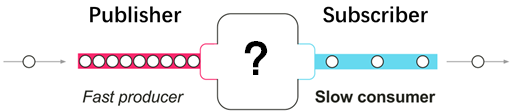

如果没有流量控制，那么订阅者会被发布者快速产生的数据流淹没。就像在一个流水线上，如果某个工位处理比较慢，而上游下料比较快的话，这个工位的工人师傅就吃不消了，这个时候他需要一种途径来告诉上游下料慢一些。 

同样的，订阅者也需要有一种能够向上游反馈流量需求的机制： 


这种能够向上游反馈流量请求的机制就叫做回压（backpressure，也有翻译为“背压”的）。

在具体的使用过程中，回压的处理会涉及不同的策略。举两个例子以便于理解： 

- **缓存的策略** 

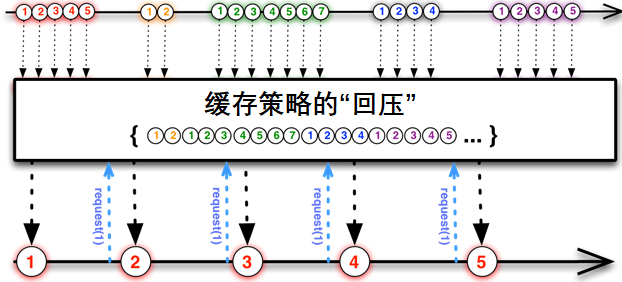

- **丢弃的策略** 

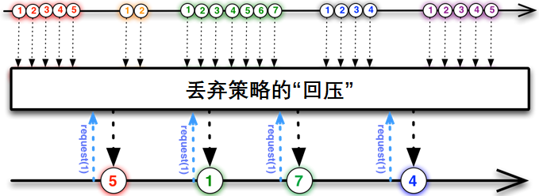

##### 1.2.3 总结
响应式流的两个核心特点：**异步非阻塞，以及基于“回压”机制的流量控制**。
这样我们有了基于响应式流的“升级版”的响应式编程：


Reactor3和RxJava2都是具有以上特点的响应式流的具体实现库。

响应式编程通常作为面向对象编程中的“观察者模式”（Observer design pattern）的一种扩展。 响应式流（reactive streams）与“迭代子模式”（Iterator design pattern）也有相通之处， 因为其中也有 Iterable-Iterator 这样的对应关系。主要的区别在于，Iterator 是基于 “拉取”（pull）方式的，而响应式流是基于“推送”（push）方式的。

使用 iterator 是一种“命令式”（imperative）编程范式，因为什么时候获取下一个元素取决于开发者。在响应式流中，相对应的角色是“发布者 - 订阅者”（Publisher-Subscriber），当有新的数据到来的时候，反过来由发布者（Publisher） 通知订阅者（Subscriber），这种“推送”模式是响应式的关键。此外，对推送来的数据的操作是通过一种声明式（declaratively）而不是命令式（imperatively）的方式表达的：开发者通过 描述“处理流程”来定义对数据流的处理逻辑。

#### 1.3 Hello, reactive world

##### 1.3.1 lambda与函数式

> https://blog.csdn.net/get_set/article/details/79480121

区别两个概念：函数响应式编程和响应式编程 

- 函数响应式编程的重点在于“函数式”的语言特性，这个概念在二十年前就[盖棺定论](http://conal.net/papers/icfp97/)了。
- 响应式编程的重点在于“基于事件流”的异步编程范式，由不断产生的数据/时间来推动逻辑的执行。

###### 1.3.1.1 lambda表达式 

lambda表达式的语法如下： 

`(type1 arg1, type2 arg2...) -> { body }` 

`->` 前后分别表示参数和方法体 

> “函数式”编程范式的核心特点之一：函数是”一等公民”。  
>
> 所谓”一等公民”（first class），指的是函数与其他数据类型一样，处于平等地位，可以赋值给其他变量，也可以作为参数，传入另一个函数，或者作为别的函数的返回值。

###### 1.3.1.2 函数式接口

像Comparator这样的只有一个抽象方法的接口，叫做函数式接口（Functional Interface）。与Comparator类似，其他**函数式接口的唯一的抽象方法也可以用lambda来表示**。

我们看一下Comparator的源码，发现其多了一个`@FunctionalInterface`的注解，用来表明它是一个函数式接口。标记了该注解的接口有且仅有一个抽象方法，否则会报编译错误。

随lambda一同增加的还有一个[`java.util.function`](https://docs.oracle.com/javase/8/docs/api/java/util/function/package-frame.html)包，其中定义了一些常见的函数式接口的。比如： 

- Function，接受一个输入参数，返回一个结果。参数与返回值的类型可以不同，我们之前的map方法内的lambda就是表示这个函数式接口的；
- Consumer，接受一个输入参数并且无返回的操作。比如我们针对数据流的每一个元素进行打印，就可以用基于Consumer的lambda；
- Supplier，无需输入参数，只返回结果。看接口名就知道是发挥了对象工厂的作用；
- Predicate，接受一个输入参数，返回一个布尔值结果。比如我们在对数据流中的元素进行筛选的时候，就可以用基于Predicate的lambda；
- ......
###### 1.3.1.3 简化的lambda

简化版本的lambda就是**方法引用**

- 方法引用就是Lambda表达式，就是函数式接口的一个实例，通过方法的名字来指向一个方法，可以认为是Lambda表达式的一个**语法糖**。 
- 要求：实现抽象方法的参数列表和返回值类型，必须与方法引用的方法的参数列表和返回值类型保持一致！ 
- 使用操作符 “`::`” 将类(或对象) 与 方法名分隔开来。 

如：

- `string -> System.out.println(string)`，可以简化为`System.out::println`，这里是将参数作为`System.out::println`的参数了；
- `() -> new HashMap<>()`，可以简化为`HashMap::new`，这里没有参数，也可以进行简化。
- ......

###### 1.3.1.4 总结

在编程语言的世界里，Java就像是一个稳健的中年人，它始终将语言的向后兼容性和稳定性放在首位，不会随随便便因为某种语言特性或语法糖就心动，但是对于有显著预期收益的语言特性也会果断出击，泛型如此，lambda亦是如此，或许对它们的引入都不够彻底和完美，但却足够实用，能够给开发者带来很大便利。


##### 1.3.2 Reactor 3快速上手

> https://blog.csdn.net/get_set/article/details/79480172

Reactor与Spring是兄弟项目，侧重于Server端的响应式编程，主要 artifact 是 reactor-core，这是一个基于 Java 8 的实现了响应式流规范 （Reactive Streams specification）的响应式库。 

###### 1.3.2.1 Flux与Mono

Reactor中的**发布者（Publisher）**由Flux和Mono两个类定义，它们都提供了丰富的操作符（operator）。一个Flux对象代表一个包含0..N个元素的响应式序列，而一个Mono对象代表一个包含零/一个（0..1）元素的结果。

既然是“数据流”的发布者，Flux和Mono都可以发出三种“数据信号”：**元素值、错误信号、完成信号**，错误信号和完成信号都是终止信号，完成信号用于告知下游订阅者该数据流正常结束，错误信号终止数据流的同时将错误传递给下游订阅者。

下图所示就是一个Flux类型的数据流，黑色箭头是时间轴。它连续发出“1” - “6”共6个元素值，以及一个完成信号（图中⑥后边的加粗竖线来表示），完成信号告知订阅者数据流已经结束。

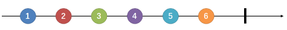

下图所示是一个Mono类型的数据流，它发出一个元素值后，又发出一个完成信号。 

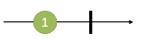

> 既然Flux具有发布一个数据元素的能力，为什么还要专门定义一个Mono类呢？举个例子，一个HTTP请求产生一个响应，所以对其进行“count”操作是没有多大意义的。表示这样一个结果的话，应该用Mono<HttpResponse>而不是 Flux<HttpResponse>，对于的操作通常只用于处理 0/1 个元素。它们从语义上就原生包含着元素个数的信息，从而避免了对Mono对象进行多元素场景下的处理。有些操作可以改变基数，从而需要切换类型。比如，count操作用于Flux，但是操作返回的结果是Mono<Long>。

###### 1.3.2.2 订阅前什么都不会发生

惰性求值

订阅就是消费，对流的操作分为两大类---中间操作和终止操作，返回的是一个流对象的话就是中间操作，返回的不是一个流对象就是终止操作。惰性求值说的是，一个流如果只有中间操作，而没有终止操作的话，所有的中间操作都是不会被执行。只有当终止操作触发时，才会回调所有的中间操作。

Flux和Mono还提供了多个`subscribe`方法的变体： 

```java
// 订阅并触发数据流
subscribe(); 
// 订阅并指定对正常数据元素如何处理
subscribe(Consumer<? super T> consumer); 
// 订阅并定义对正常数据元素和错误信号的处理
subscribe(Consumer<? super T> consumer,
          Consumer<? super Throwable> errorConsumer); 
// 订阅并定义对正常数据元素、错误信号和完成信号的处理
subscribe(Consumer<? super T> consumer,
          Consumer<? super Throwable> errorConsumer,
          Runnable completeConsumer); 
// 订阅并定义对正常数据元素、错误信号和完成信号的处理，以及订阅发生时的处理逻辑
subscribe(Consumer<? super T> consumer,
          Consumer<? super Throwable> errorConsumer,
          Runnable completeConsumer,
          Consumer<? super Subscription> subscriptionConsumer); 
```

###### 1.3.2.3 测试与调试

基本的单元测试工具——`StepVerifier`

###### 1.3.2.4 操作符(Operator)

通常情况下，我们需要对源发布者发出的原始数据流进行多个阶段的处理，并最终得到我们需要的数据。这种感觉就像是一条流水线，从流水线的源头进入传送带的是原料，经过流水线上各个工位的处理，逐渐由原料变成半成品、零件、组件、成品，最终成为消费者需要的包装品。这其中，流水线源头的下料机就相当于源发布者，消费者就相当于订阅者，流水线上的一道道工序就相当于一个一个的操作符（Operator）。

下面介绍一些我们常用的操作符：

1. **map - 元素映射为新元素** 

   `map`操作可以将数据元素进行转换/映射，得到一个新元素。 

   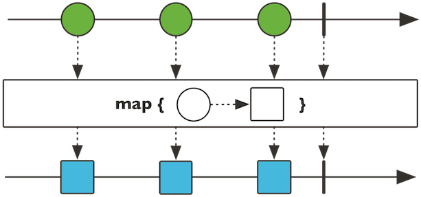

   ```java
   public final <V> Flux<V> map(Function<? super T,? extends V> mapper)
   public final <R> Mono<R> map(Function<? super T, ? extends R> mapper) 
   ```

   上图是Flux的map操作示意图，上方的箭头是原始序列的时间轴，下方的箭头是经过map处理后的数据序列时间轴。

   `map`接受一个`Function`的函数式接口为参数，这个函数式的作用是定义转换操作的策略。举例说明：

   ```java
   StepVerifier.create(Flux.range(1, 6)    // 1
               .map(i -> i * i))   // 2
               .expectNext(1, 4, 9, 16, 25, 36)    //3
               .expectComplete();  // 4
   
   1. Flux.range(1, 6)用于生成从“1”开始的，自增为1的“6”个整型数据；
   2. map接受lambdai -> i * i为参数，表示对每个数据进行平方；
   3. 验证新的序列的数据；
   4. verifyComplete()相当于expectComplete().verify()。
   ```

2. **flatMap - 元素映射为流** 

   `flatMap`操作可以将每个数据元素转换/映射为一个流，然后将这些流合并为一个大的数据流。 

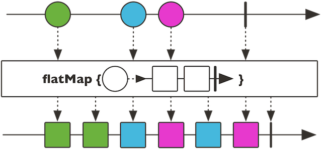

​	注意到，流的合并是异步的，先来先到，并非是严格按照原始序列的顺序（如图蓝色和红色方块是交叉的）。	

   ```java
public final <R> Flux<R> flatMap(Function<? super T, ? extends Publisher<? extends R>> mapper)
public final <R> Mono<R> flatMap(Function<? super T, ? extends Mono<? extends R>> transformer)
   ```

`flatMap` 也是接收一个 `Function`的函数式接口为参数，这个函数式的输入为一个T类型数据值，对于Flux来说输出可以是Flux和Mono，对于Mono来说输出只能是Mono。举例说明： 

```java
 StepVerifier.create(
        Flux.just("flux", "mono")
                .flatMap(s -> Flux.fromArray(s.split("\\s*"))   // 1
                        .delayElements(Duration.ofMillis(100))) // 2
                .doOnNext(System.out::print)) // 3
        .expectNextCount(8) // 4
        .verifyComplete();
        
1. 对于每一个字符串s，将其拆分为包含一个字符的字符串流；
2. 对每个元素延迟100ms；
3. 对每个元素进行打印（注doOnNext方法是“偷窥式”的方法，不会消费数据流）；
4. 验证是否发出了8个元素。
```

打印结果为`mfolnuox`，原因在于各个拆分后的小字符串都是间隔100ms发出的，因此会交叉。 

flatMap通常用于每个元素又会引入数据流的情况，比如我们有一串url数据流，需要请求每个url并收集response数据。假设响应式的请求方法如下：

```
Mono<HttpResponse> requestUrl(String url) {...}
```

而url数据流为一个Flux<String> urlFlux，那么为了得到所有的HttpResponse，就需要用到flatMap：

```
urlFlux.flatMap(url -> requestUrl(url));
```

其返回内容为Flux<HttpResponse>类型的HttpResponse流。

3. **filter - 过滤** 

   `filter`操作可以对数据元素进行筛选。 

   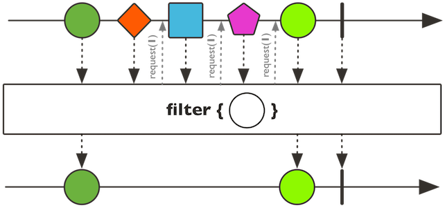

   ```java
   public final Flux<T> filter(Predicate<? super T> tester)
   public final Mono<T> filter(Predicate<? super T> tester) 
   ```

   `filter`接受一个`Predicate`的函数式接口为参数，这个函数式的作用是进行判断并返回boolean。举例说明： 

   ```java
   StepVerifier.create(Flux.range(1, 6)
               .filter(i -> i % 2 == 1)    // 1
               .map(i -> i * i))
               .expectNext(1, 9, 25)   // 2
               .verifyComplete();
               
   1. filter的lambda参数表示过滤操作将保留奇数；
   2. 验证仅得到奇数的平方。
   ```

4. **zip - 一对一合并** 

   看到`zip`这个词可能会联想到拉链，它能够将多个流一对一的合并起来。zip有多个方法变体，我们介绍一个最常见的二合一的。 

   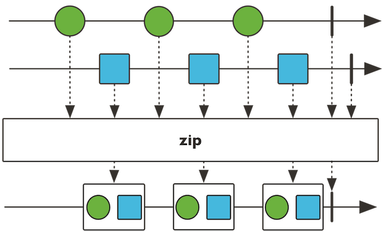

   它对两个Flux/Mono流每次各取一个元素，合并为一个二元组（`Tuple2`）： 

   ```java
   public static <T1,T2> Flux<Tuple2<T1,T2>> zip(Publisher<? extends T1> source1,
                                             Publisher<? extends T2> source2)
   public static <T1, T2> Mono<Tuple2<T1, T2>> zip(Mono<? extends T1> p1, Mono<? extends T2> p2) 
   ```

   `Flux`的`zip`方法接受Flux或Mono为参数，`Mono`的`zip`方法只能接受Mono类型的参数。 

   举个例子，假设我们有一个关于zip方法的说明：“Zip two sources together, that is to say wait for all the sources to emit one element and combine these elements once into a Tuple2.”，我们希望将这句话拆分为一个一个的单词并以每200ms一个的速度发出，除了前面flatMap的例子中用到的delayElements，可以如下操作：

   ```java
   private Flux<String> getZipDescFlux() {
       String desc = "Zip two sources together, that is to say wait for all the sources to emit one element and combine these elements once into a Tuple2.";
       return Flux.fromArray(desc.split("\\s+"));  // 1
   }
   
   @Test
   public void testSimpleOperators() throws InterruptedException {
       CountDownLatch countDownLatch = new CountDownLatch(1);  // 2
       Flux.zip(
               getZipDescFlux(),
               Flux.interval(Duration.ofMillis(200)))  // 3
               .subscribe(t -> System.out.println(t.getT1()), null, countDownLatch::countDown);    // 4
       countDownLatch.await(10, TimeUnit.SECONDS);     // 5
   }
   
   1. 将英文说明用空格拆分为字符串流；
   2. 定义一个CountDownLatch( 一种锁 )，初始为1，则会等待执行1次countDown方法后结束，不使用它的话，测试方法所在的线程会直接返回而不会等待数据流发出完毕；
   3. 使用Flux.interval声明一个每200ms发出一个元素的long数据流；因为zip操作是一对一的，故而将其与字符串流zip之后，字符串流也将具有同样的速度；
   4. zip之后的流中元素类型为Tuple2，使用getT1方法拿到字符串流的元素；定义完成信号的处理为countDown;
   5. countDownLatch.await(10, TimeUnit.SECONDS)会等待countDown倒数至0，最多等待10秒钟。
   ```

   除了`zip`静态方法之外，还有`zipWith`等非静态方法，效果与之类似： 

   ```java
   getZipDescFlux().zipWith(Flux.interval(Duration.ofMillis(200)))
   ```

   在异步条件下，数据流的流速不同，使用zip能够一对一地将两个或多个数据流的元素对齐发出。 

5. **更多** 

   Reactor中提供了非常丰富的操作符，除了以上几个常见的，还有： 

   - 用于编程方式自定义生成数据流的`create`和`generate`等及其变体方法；
   - 用于“无副作用的peek”场景的`doOnNext`、`doOnError`、`doOncomplete`、`doOnSubscribe`、`doOnCancel`等及其变体方法；
   - 用于数据流转换的`when`、`and/or`、`merge`、`concat`、`collect`、`count`、`repeat`等及其变体方法；
   - 用于过滤/拣选的`take`、`first`、`last`、`sample`、`skip`、`limitRequest`等及其变体方法；
   - 用于错误处理的`timeout`、`onErrorReturn`、`onErrorResume`、`doFinally`、`retryWhen`等及其变体方法；
   - 用于分批的`window`、`buffer`、`group`等及其变体方法；
   - 用于线程调度的`publishOn`和`subscribeOn`方法。

   使用这些操作符，你几乎可以搭建出能够进行任何业务需求的数据处理管道/流水线。 

###### 1.3.2.5 调度器与线程模型

在Reactor中，对于多线程并发调度的处理变得异常简单。 

在以往的多线程开发场景中，我们通常使用`Executors`工具类来创建线程池，通常有如下四种类型： 

- `newCachedThreadPool`创建一个弹性大小缓存线程池，如果线程池长度超过处理需要，可灵活回收空闲线程，若无可回收，则新建线程；
- `newFixedThreadPool`创建一个大小固定的线程池，可控制线程最大并发数，超出的线程会在队列中等待；
- `newScheduledThreadPool`创建一个大小固定的线程池，支持定时及周期性的任务执行；
- `newSingleThreadExecutor`创建一个单线程化的线程池，它只会用唯一的工作线程来执行任务，保证所有任务按照指定顺序(FIFO, LIFO, 优先级)执行。

此外，`newWorkStealingPool`还可以创建支持work-stealing的线程池。 

说良心话，Java提供的Executors工具类使得我们对ExecutorService使用已经非常得心应手了。BUT~ Reactor让线程管理和任务调度更加“傻瓜”——调度器（Scheduler）帮助我们搞定这件事。Scheduler是一个拥有多个实现类的抽象接口。Schedulers类（按照通常的套路，最后为s的就是工具类咯）提供的静态方法可搭建以下几种线程执行环境：

- 当前线程（`Schedulers.immediate()`）；
- 可重用的单线程（`Schedulers.single()`）。注意，这个方法对所有调用者都提供同一个线程来使用， 直到该调度器被废弃。如果你想使用独占的线程，请使用`Schedulers.newSingle()`；
- 弹性线程池（Schedulers.elastic()）。它根据需要创建一个线程池，重用空闲线程。线程池如果空闲时间过长 （默认为 60s）就会被废弃。对于 I/O 阻塞的场景比较适用。Schedulers.elastic()能够方便地给一个阻塞 的任务分配它自己的线程，从而不会妨碍其他任务和资源；
- 固定大小线程池（`Schedulers.parallel()`），所创建线程池的大小与CPU个数等同；
- 自定义线程池（`Schedulers.fromExecutorService(ExecutorService)`）基于自定义的ExecutorService创建 Scheduler（虽然不太建议，不过你也可以使用Executor来创建）。

Schedulers类已经预先创建了几种常用的线程池：使用`single()`、`elastic()`和`parallel()`方法可以分别使用内置的单线程、弹性线程池和固定大小线程池。如果想创建新的线程池，可以使用`newSingle()`、`newElastic()`和`newParallel()`方法。

`Executors`提供的几种线程池在Reactor中都支持： 

- `Schedulers.single()`和`Schedulers.newSingle()`对应`Executors.newSingleThreadExecutor()`；
- `Schedulers.elastic()`和`Schedulers.newElastic()`对应`Executors.newCachedThreadPool()`；
- `Schedulers.parallel()`和`Schedulers.newParallel()`对应`Executors.newFixedThreadPool()`；
- `Schedulers`提供的以上三种调度器底层都是基于`ScheduledExecutorService`的，因此都是支持任务定时和周期性执行的； 
- `Flux`和`Mono`的调度操作符`subscribeOn`和`publishOn`支持work-stealing。

**举例：将同步的阻塞调用变为异步的** 

前面介绍到`Schedulers.elastic()`能够方便地给一个阻塞的任务分配专门的线程，从而不会妨碍其他任务和资源。我们就可以利用这一点将一个同步阻塞的调用调度到一个自己的线程中，并利用订阅机制，待调用结束后异步返回。 

**切换调度器的操作符** 

Reactor 提供了两种在响应式链中调整调度器 Scheduler的方法：`publishOn`和`subscribeOn`。它们都接受一个 `Scheduler`作为参数，从而可以改变调度器。但是`publishOn`在链中出现的位置是有讲究的，而`subscribeOn` 则无所谓。 


> 假设与上图对应的代码是： 
> Flux.range(1, 1000) 
> .map(…) 
> .publishOn(Schedulers.elastic()).filter(…) 
> .publishOn(Schedulers.parallel()).flatMap(…) 
> .subscribeOn(Schedulers.single()) 
- 如图所示，`publishOn`会影响链中其后的操作符，比如第一个publishOn调整调度器为elastic，则`filter`的处理操作是在弹性线程池中执行的；同理，`flatMap`是执行在固定大小的parallel线程池中的；
- `subscribeOn`无论出现在什么位置，都只影响源头的执行环境，也就是`range`方法是执行在单线程中的，直至被第一个`publishOn`切换调度器之前，所以`range`后的`map`也在单线程中执行。

###### 1.3.2.6 错误处理

在响应式流中，错误（error）是终止信号。当有错误发生时，它会导致流序列停止，并且错误信号会沿着操作链条向下传递，直至遇到subscribe中的错误处理方法。这样的错误还是应该在应用层面解决的。否则，你可能会将错误信息显示在用户界面，或者通过某个REST endpoint发出。所以还是建议在subscribe时通过错误处理方法妥善解决错误。

###### 1.3.2.7 回压(背压)

前边的例子并没有进行流量控制，也就是，当执行`.subscribe(System.out::println)`这样的订阅的时候，直接发起了一个无限的请求（unbounded request），就是对于数据流中的元素无论快慢都“照单全收”。 

`subscribe`方法还有一个变体： 

```java
// 接收一个Subscriber为参数，该Subscriber可以进行更加灵活的定义
subscribe(Subscriber subscriber)
```

> 注：其实这才是`subscribe`方法本尊，前边介绍到的可以接收0~4个函数式接口为参数的`subscribe`最终都是拼装为这个方法，所以按理说前边的`subscribe`方法才是“变体”。 

###### 1.3.2.8 总结

从命令式编程到响应式编程的切换并不是一件容易的事，需要一个适应的过程。 

使用Reactor编程的一些特点： 

- 相对于传统的基于回调和Future的异步开发方式，响应式编程更加具有**可编排性和可读性**，配合lambda表达式，代码更加简洁，处理逻辑的表达就像装配“流水线”，适用于对数据流的处理；
- 在**订阅（subscribe）时才触发数据流**，这种数据流叫做“冷”数据流，就像插座插上电器才会有电流一样，还有一种数据流不管是否有订阅者订阅它都会一直发出数据，称之为“热”数据流，Reactor中几乎都是“冷”数据流；
- **调度器对线程管理进行更高层次的抽象**，使得我们可以非常容易地切换线程执行环境；
- **灵活的错误处理机制**有利于编写健壮的程序；
- **“回压(背压)”机制**使得订阅者可以无限接受数据并让它的源头“满负荷”推送所有的数据，也可以通过使用`request`方法来告知源头它一次最多能够处理 n 个元素，从而将“推送”模式转换为“推送+拉取”混合的模式。

##### 1.3.3 Spring WebFlux

> https://blog.csdn.net/get_set/article/details/79480233

Spring WebFlux 是随Spring5 推出的响应式Web框架

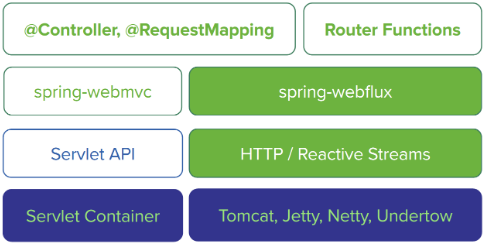

1. **服务端技术栈**

   Spring提供了完整的支持响应式的服务端技术栈。 

   如上图所示，左侧为基于spring-webmvc的技术栈，右侧为基于spring-webflux的技术栈：

   - Spring WebFlux是基于响应式流的，因此可以用来建立异步的、非阻塞的、事件驱动的服务。它采用Reactor作为首选的响应式流的实现库，不过也提供了对RxJava的支持。
   - 由于响应式编程的特性，Spring WebFlux和Reactor底层需要支持异步的运行环境，比如Netty和Undertow；也可以运行在支持异步I/O的Servlet 3.1的容器之上，比如Tomcat（8.0.23及以上）和Jetty（9.0.4及以上）。
   - 从图的纵向上看，spring-webflux上层支持两种开发模式：  
     - 类似于Spring WebMVC的基于注解（`@Controller`、`@RequestMapping`）的开发模式；
     - Java 8 lambda 风格的函数式开发模式。
   - Spring WebFlux也支持响应式的WebSocket服务端开发。

   > 由此看来，Spring WebFlux与Vert.x有一些相通之处，都是建立在非阻塞的异步I/O和事件驱动的基础之上的。 

2. **响应式Http客户端** 

   此外，Spring WebFlux也提供了一个**响应式的Http客户端**API `WebClient`。它可以用函数式的方式异步非阻塞地发起Http请求并处理响应。其底层也是由Netty提供的异步支持。 

   我们可以把`WebClient`看做是响应式的`RestTemplate`，与后者相比，前者： 

   - 非阻塞的，可以基于少量的线程处理更高的并发； 
   - 可以使用Java 8 lambda表达式；
   - 支持异步的同时也可以支持同步的使用方式；
   - 可以通过数据流的方式与服务端进行双向通信。

   当然，与服务端对应的，Spring WebFlux也提供了响应式的Websocket客户端API。 

本小节目标：

1. 先介绍一下使用Spring WebMVC风格的基于注解的方式如何编写响应式的Web服务，这几乎没有学习成本，非常赞。虽然这种方式在开发上与Spring WebMVC变化不大，但是框架底层已经是完全的响应式技术栈了；
2. 再进一步介绍函数式的开发模式；
3. 简单几行代码实现服务端推送（Server Send Event，**SSE**）；
4. 然后我们再加入响应式数据库的支持（使用Reactive Spring Data for MongoDB）；
5. 使用`WebClient`与前几步做好的服务端进行通信；
6. 最后我们看一下如何通过“流”的方式在Http上进行通信。

###### 1.3.3.1 基于WebMVC注解的方式

比较Spring-WebMVC 和 Spring-WebFlux 的入门demo可以发现：Spring真是用心良苦，WebFlux提供了与之前WebMVC相同的一套注解来定义请求的处理，使得Spring使用者迁移到响应式开发方式的过程变得异常轻松。 

整个技术栈从命令式的、同步阻塞的**spring-webmvc + servlet + Tomcat**，变成了响应式的、异步非阻塞的**spring-webflux + Reactor + Netty**。 

Netty是一套异步的、事件驱动的网络应用程序框架和工具，能够开发高性能、高可靠性的网络服务器和客户端程序，因此与同样是异步的、事件驱动的响应式编程范式一拍即合。 

###### 1.3.3.2 WebFlux的函数式开发模式

既然是响应式编程了，WebFlux可以满足统一用函数式的编程风格。WebFlux提供了一套函数式接口，可以用来实现类似MVC的效果。 

回想一下在使用`controller`开发时，对请求的定义和处理逻辑，主要有两点：

- 使用方法定义处理逻辑；
- 用`@RequestMapping`注解定义好这个方法对什么样url进行响应。 

在WebFlux的函数式开发模式中，我们用`HandlerFunction`和`RouterFunction`来实现上边这两点：

- `HandlerFunction`相当于`Controller`中的具体处理方法，输入为请求，输出为装在`Mono`中的响应：

  ```java
  Mono<T extends ServerResponse> handle(ServerRequest request);
  ```

- `RouterFunction`，顾名思义，路由，相当于`@RequestMapping`，用来判断什么样的url映射到那个具体的`HandlerFunction`，输入为请求，输出为装在Mono里边的`Handlerfunction`：

  ```java
  Mono<HandlerFunction<T>> route(ServerRequest request);
  ```

  我们看到，在WebFlux中，请求和响应不再是WebMVC中的ServletRequest和ServletResponse，而是ServerRequest和ServerResponse。后者是在响应式编程中使用的接口，它们提供了对**非阻塞和回压特性**的支持，以及Http消息体与响应式类型Mono和Flux的转换方法。

*Demo 见IDEA工程：webflux_02*

###### 1.3.3.3 服务器推送

我们可能会遇到一些需要网页与服务器端保持连接（起码看上去是保持连接）的需求，比如类似微信网页版的聊天类应用，比如需要频繁更新页面数据的监控系统页面或股票看盘页面。我们通常采用如下几种技术： 

- **短轮询**：利用ajax定期向服务器请求，无论数据是否更新立马返回数据，高并发情况下可能会对服务器和带宽造成压力；
- **长轮询**：利用comet不断向服务器发起请求，服务器将请求暂时挂起，直到有新的数据的时候才返回，相对短轮询减少了请求次数；
- **SSE**：服务端推送（Server Send Event），在客户端发起一次请求后会保持该连接，服务器端基于该连接持续向客户端发送数据，从HTML5开始加入。
- **WebSocket**：这是也是一种保持连接的技术，并且是双向的，从HTML5开始加入，并非完全基于HTTP，适合于频繁和较大流量的双向通讯场景。

既然响应式编程是一种基于数据流的编程范式，自然在服务器推送方面得心应手。

*Demo 见IDEA工程：webflux_02*

###### 1.3.3.4 响应式Spring Data

开发基于响应式流的应用，就像是在搭建数据流流动的管道，从而异步的数据能够顺畅流过每个环节。前边的例子主要聚焦于应用层，然而绝大多数系统免不了要与数据库进行交互，所以我们也需要响应式的持久层API和支持异步的数据库驱动。就像从自来水厂到家里水龙头这个管道中，如果任何一个环节发生了阻塞，那就可能造成整体吞吐量的下降。

各个数据库都开始陆续推出异步驱动，目前Spring Data支持的可以进行响应式数据访问的数据库有MongoDB、Redis、Apache Cassandra和CouchDB。今天我们用**MongoDB**来写一个响应式demo。 

*Demo 见IDEA工程：webflux_02*

如果有Spring Data开发经验的话，切换到Spring Data Reactive的难度并不高。跟Spring WebFlux类似：原来返回`User`的话，那现在就返回`Mono<User>`；原来返回`List<User>`的话，那现在就返回`Flux<User>`。 

对于稍微复杂的业务逻辑或一些必要的异常处理，比如上边的save方法，请一定采用响应式的编程方式来定义，从而一切都是异步非阻塞的。如下图所示，从HttpServer（如Netty或Servlet3.1以上的Servlet容器）到ServerAdapter（Spring WebFlux框架提供的针对不同server的适配器），到我们编写的Controller和DAO，以及异步数据库驱动，构成了一个完整的**异步非阻塞的管道**，里边流动的就是响应式流。

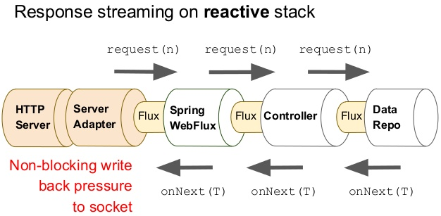

###### 1.3.3.5 使用WebClient开发响应式Http客户端

*Demo 见IDEA工程：webflux_02* 的 测试代码

###### 1.3.3.6 让数据在Http上双向无限流动起来

许多朋友看到这个题目会想到Websocket，的确，Websocket确实可以实现全双工通信，但它的数据传输并非是完全基于HTTP协议的。

下面我们实现一个这样两个Endpoint：  

- POST方法的`/events`，“源源不断”地收集数据，并存入数据库；  
- GET方法的`/events`，“源源不断”将数据库中的记录发出来。 

> 详细的查看原博客，和IDEA工程

###### 1.3.3.7 总结

这一节，我们对WebFlux做了一个简单的基于实例的介绍，相信你对响应式编程及其在WEB应用中如何发挥作用有了更多的体会，本章的实战是比较基础的，初衷是希望能够通过上手编写代码体会响应式编程的感觉，因为切换到响应式思维方式并非易事。 

这一章的核心关键词其实翻来覆去就是：“**异步非阻塞的响应式流**”。我们了解了异步非阻塞的好处，也知道如何让数据流动起来，下面我们就通过对实例的性能测试，借助实实在在的数据，真切感受一下异步非阻塞的“丝滑”。 

#### 1.4 从负载测试看异步非阻塞的优势

##### 1.4.1 带有延迟的负载测试分析

> https://blog.csdn.net/get_set/article/details/79492439

##### 1.4.2 调用带有延迟的服务负载分析

> https://blog.csdn.net/get_set/article/details/79506373

由于微服务架构的盛行，大型系统内服务间基于HTTP API进行调用的会相当频繁。Netflix的系统有500+的微服务，感受一下~ 

我们的测试如下图所示，服务A调用服务B的API，从服务A发出请求到接收到响应，期间可能存在延迟，比如网络不稳定、服务B不稳定，或因为所请求的API本身执行时间略长等等。对于作为HTTP客户端的服务A来说，是否能够异步地处理对服务B的请求与响应，也会带来明显的性能差异。

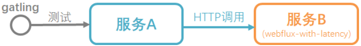

我们创建两个服务A的项目：`restTemplate-as-caller`和`webClient-as-caller`。它们也都提供URL为`/hello/{latency}`的API，在API的实现上都是通过Http请求服务A的`/hello/{latency}`，返回的数据作为自己的响应。区别在于：`restTemplate-as-caller`使用`RestTemplate`作为Http客户端，`webClient-as-caller`使用`WebClient`作为Http客户端。

测试内容详见上面的博客

**总结：**WebClient同样能够以少量而固定的线程数处理高并发的Http请求，在基于Http的服务间通信方面，可以取代RestTemplate以及AsyncRestTemplate。 

##### 1.4.3 Netflix的异步化案例

> https://blog.csdn.net/get_set/article/details/79506578

在微服务架构中，通常少不了服务API网关这样一个组件。用过Spring Cloud的朋友对Zuul这个组件应该是熟悉的。zuul是netflix开源的一个API Gateway服务器，云平台上提供动态路由，监控，弹性，安全等边缘服务，相当于是所有服务API的“前台”。 

如果不了解，也没关系，先介绍一个Zuul的基础功能——路由： 

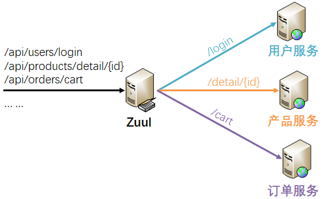

如图，作为“前台”的Zuul能够根据一定的规则将到来的请求分发到各个具体的服务，仅就这一个功能来说，Zuul通常会承载较大流量，而且与上边第二个测试的例子类似——业务逻辑很少，它的响应时长的主要由被路由服务的响应时长决定。 

2016年以前，Netflix的Zuul 1本质上一个web servlet应用，因此是多线程的、阻塞的，也就是说对每一个Http连接都会用一个单独的线程来处理。在Zuul 1中，对于IO操作，会再用一个工作线程来执行，工作线程中的IO操作执行完成后会通知处理请求的线程，操作完成前，后者是阻塞的。

......

在一个分布式系统里，许多依赖不可避免的会出现类似的窘境甚至调用失败，因此Netflix又开发了Hystrix组件（也集成在Spring Cloud中）来应对这种问题，它提供了熔断、隔离、Fallback、cache、监控等功能，能够在一个或多个依赖出现超时、异常等问题时保证系统依然可用。

但Hystrix并非根本解决之道，问题的根源在于同步阻塞的服务调用。于是Netflix开发了Zuul 2，它基于Netty，以异步非阻塞的方式来处理请求，一个CPU核心专心处理一个线程，每一个请求的生命周期存在于Event Loop和Callback中。如下图所示： 

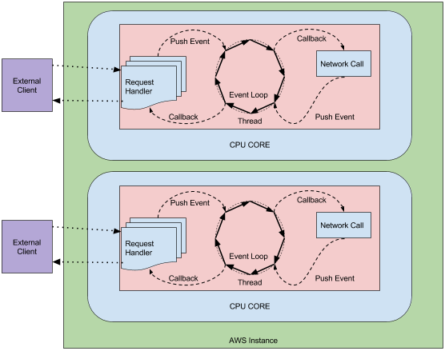

从资源成本的角度来说，由于不用为每一个请求开辟独立的线程，能够避免CPU线程切换、大量线程栈内存造成的资源浪费，基本只剩下文件描述符和回调Listener的成本，从而Http连接成本显著降低。此外，由于工作在一个线程上，CPU除了不用来回奔波于成百上千的线程，还能更好地利用一二级CPU缓存，从而进一步提高性能。

不同于计算密集型的应用，WEB应用通常是高并发和I/O密集型的，尤其是在微服务架构的应用中，CPU执行时间相对于阻塞时间来说通常要短得多，越是如此，异步非阻塞越能发挥出显著的性能提升效果。从这个案例可以看到，以异步非阻塞的方式代替阻塞和多线程方式是提高性能的有效途径。 

##### 1.4.4 同步与异步数据库驱动的性能对比

> https://blog.csdn.net/get_set/article/details/79506591

**总结**：分别针对[Http服务端](http://blog.csdn.net/get_set/article/details/79492439)、[Http客户端](http://blog.csdn.net/get_set/article/details/79506373)以及数据库进行了同步和异步的测试对比，综上来看，**基于异步非阻塞的响应式应用或驱动能够以少量且固定的线程应对高并发的请求或调用，对于存在阻塞的场景，能够比多线程的并发方案提供更高的性能。** 

响应式和非阻塞并不是总能让应用跑的更快，况且将代码构建为非阻塞的执行方式本身还会带来少量的成本。但是在类似于WEB应用这样的高并发、少计算且I/O密集的应用中，响应式和非阻塞往往能够发挥出价值。尤其是微服务应用中，网络I/O比较多的情况下，效果会更加惊人。 

---

#### 1.5 响应式系统

##### 1.5.1 响应式宣言

> https://blog.csdn.net/get_set/article/details/79506602

https://www.reactivemanifesto.org/zh-CN

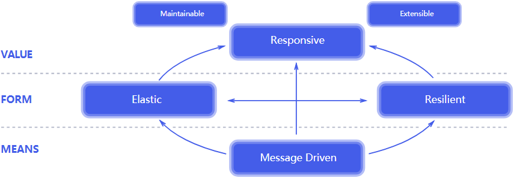

以响应式系统方式构建的系统更加灵活，松耦合和可扩展。这使得它们更容易开发，而且更加拥抱变化。及时地响应，以保证良好的用户体验。系统错误和异常在所难免，当异常出现时，要优雅地处理之，不要任其蔓延、甚至到达用户眼前。 

从落地方面，我们不难想到一些具体技术来支撑响应式宣言的目标： 

- 比如如今比较火热的云原生和DevOps的理念与实践，以及更早一些的自动化运维，都有助于让系统更加Elastic，不过系统架构的微服务化也是功不可没；
- 类似于Hystrix的熔断器（Circuit Breaker）使得系统更加Resilient，因为它能够及时将服务异常遏制在可控范围内，避免雪崩；而类似kubernetes的云原生应用能够及时发现和重建系统中的异常服务；
- 而类似RabbitMQ、ActiveMQ这样的消息队列产品有助于构建消息驱动的系统，并发挥解耦、提速、广播、削峰的作用；
- 消息驱动有利于系统的弹性和可靠性，弹性和可靠性又使得系统的响应更加及时；
- ......

##### 1.5.2 响应式编程与相应是系统

响应式宣言是一组架构与设计原则，符合这些原则的系统可以认为是响应式的系统。而响应式系统与响应式编程是不同层面的内容。 

**总结：**响应式编程技术通常用于在单个节点或服务中对数据流进行异步非阻塞的处理。当有多个结点时，就需要认真考量数据一致性（data consistency）、跨结点沟通（cross-node communication）、协调（coordination）、版本控制（versioning）、编排（orchestration）、错误管理（failure management）、关注与责任（concerns and responsibilities）分离等等的内容——这些都是响应式系统架构要考虑的内容。

类似的，Spring WebFlux是一种响应式编程框架，用于开发响应式应用，而Spring Cloud不仅是更是一套适应于当今云原生环境下微服务架构基础，更加接近响应式宣言的目标和响应式系统的设计原则。

不过也应该看到，也正是由于响应式宣言中对现代系统的Responsive、Resilient、Elastic和Message Driven的要求，使得对响应式编程技术的呼声越来越高，显然响应式编程技术是构建响应式系统的合适工具之一。尤其是随着面向响应式宣言的响应式流规范（Reactive Streams Specification）这一顶层设计的提出，类似Reactor、RxJava、Vert.x、Spring WebFlux等的响应式编程技术在响应式系统中必将发挥越来越大的作用。

### 2. 响应式编程之法

#### 2.1 响应式流范式

> https://blog.csdn.net/get_set/article/details/79514670

现代软件对近乎实时地处理数据的需求越来越强烈，对不断变化的信息的即时响应，意味着更大的商业价值，流处理是一种快速将数据转换为有用信息的手段。 

数据流中的元素可以是一个一个的待计算的数据，也可以是一个一个待响应的事件。前者多用于大数据处理，比如Storm、Spark等产品，后者常用于响应式编程，比如Netflix在使用的RxJava、Scala编程语言的发明者Typesafe公司（已更名为Lightbend）的Akka Stream、Java开发者都熟悉的Pivotal公司的Project Reactor、走在技术前沿的Vert.x等。

软件行业是一个非常注重分享和交流的行业。随着对响应式编程技术的讨论与沟通逐渐深入，2013年末的时候，Netflix、Pivotal、Typesafe等公司的工程师们共同发起了关于制定“响应式流规范（Reactive Stream Specification）”的倡议和讨论，并在github上创建了reactive-streams-jvm项目。到2015年5月份，1.0版本的规范出炉，项目README就是规范正文。

软件行业是一个非常注重分享和交流的行业。随着对响应式编程技术的讨论与沟通逐渐深入，2013年末的时候，Netflix、Pivotal、Typesafe等公司的工程师们共同发起了关于制定“响应式流规范（Reactive Stream Specification）”的倡议和讨论，并在github上创建了reactive-streams-jvm项目。到2015年5月份，1.0版本的规范出炉，项目README就是规范正文。


虽然响应式流规范是用来约束响应式开发库的，作为使用者的我们如果能够了解这一规范对于我们理解开发库的使用也是很有帮助的，因为规范的内容都是对响应式编程思想的精髓的呈现。访问[reactive-streams-jvm](https://github.com/reactive-streams/reactive-streams-jvm)项目，可以浏览规范的细节，包括其中定义的响应式流的特点： 

- 具有处理无限数量的元素的能力；
- 按序处理；
- 异步地传递元素；
- 必须实现非阻塞的回压（backpressure）。

##### 2.1.1 响应式流接口

响应式流规范定义了四个接口，如下： 

1. `Publisher`是能够发出元素的发布者。 

   ```java
   public interface Publisher<T> {
       public void subscribe(Subscriber<? super T> s);
   }
   ```

2. `Subscriber`是接收元素并做出响应的订阅者。 

   ```java
   public interface Subscriber<T> {
       public void onSubscribe(Subscription s);
       public void onNext(T t);
       public void onError(Throwable t);
       public void onComplete();
   }
   ```

   当执行subscribe方法时，发布者会回调订阅者的onSubscribe方法，这个方法中，通常订阅者会借助传入的Subscription向发布者请求n个数据。然后发布者通过不断调用订阅者的onNext方法向订阅者发出最多n个数据。如果数据全部发完，则会调用onComplete告知订阅者流已经发完；如果有错误发生，则通过onError发出错误数据，同样也会终止流。

   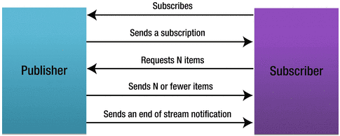

   订阅后的回调用表达式表示就是`onSubscribe onNext* (onError | onComplete)?`，即以一个`onSubscribe`开始，中间有0个或多个`onNext`，最后有0个或1个`onError`或`onComplete`事件。 

   `Publisher`和`Subscriber`融合了迭代器模式和观察者模式。 

   我们经常用到的`Iterable`和`Iterator`就是迭代器模式的体现，可以满足上边第1和2个特点关于按需处理数据流的要求；而观察者模式基于事件的回调机制有助于满足第3个特点关于异步传递元素的要求。 

3. `Subscription`是`Publisher`和`Subscriber`的“中间人”。 用这个概念来描述一种订阅任务

   ```java
   public interface Subscription {
       public void request(long n);
       public void cancel();
   }
   ```

   当发布者调用`subscribe`方法注册订阅者时，会通过订阅者的回调方法`onSubscribe`传入`Subscription`对象，之后订阅者就可以使用这个`Subscription`对象的`request`方法向发布者“要”数据了。回压机制正是基于此来实现的，因此第4个特点也能够实现了。

4. `Processor`集`Publisher`和`Subscriber`于一身。 

   ```java
   public interface Processor<T, R> extends Subscriber<T>, Publisher<R> {}
   ```

   这四个接口在[JEP 266](http://openjdk.java.net/jeps/266)跟随Java 9版本被[引入了Java SDK](http://www.reactive-streams.org/)。

   这四个接口是实现各开发库之间互相兼容的桥梁，响应式流规范也仅仅聚焦于此，而对诸如转换、合并、分组等等的操作一概未做要求，因此是一个非常抽象且精简的接口规范。

##### 2.1.2 照虎画猫，理解订阅后发生了什么

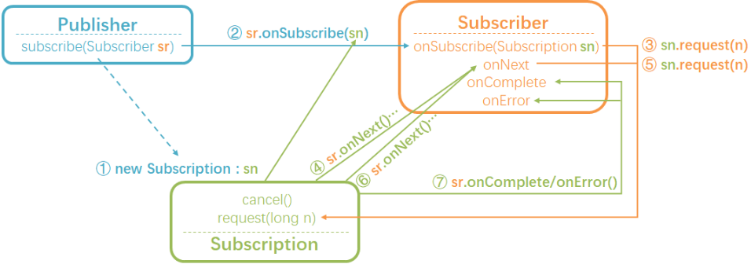

上图的这个过程基本适用于大多数的用于生成`Flux`/`Mono`的静态工厂方法，如`Flux.just`、`Flux.range`等。 

首先，使用类似`Flux.just`的方法创建发布者后，会创建一个具体的发布者（`Publisher`），如`FluxArray`。 

1. 当使用`.subscribe`订阅这个发布者时，首先会new一个具有相应逻辑的`Subscription`（如`ArraySubscription`，这个`Subscription`定义了如何处理下游的`request`，以及如何“发出数据”）；
2. 然后发布者将这个`Subscription`通过订阅者的`.onSubscribe`方法传给订阅者；
3. 在订阅者的`.onSubscribe`方法中，需要通过`Subscription`发起第一次的请求`.request`；
4. `Subscription`收到请求，就可以通过回调订阅者的`onNext`方法发出元素了，有多少发多少，但不能超过请求的个数；
5. 订阅者在`onNext`中通常定义对元素的处理逻辑，处理完成之后，可以继续发起请求；
6. 发布者根据继续满足订阅者的请求；
7. 直至发布者的序列结束，通过订阅者的`onComplete`予以告知；当然序列发送过程中如果有错误，则通过订阅者的`onError`予以告知并传递错误信息；这两种情况都会导致序列终止，订阅过程结束。

以上从1~7这些阶段称为**订阅期（subscribe time）**。 

##### 2.1.3 照虎画猫，操作符“流水线”

响应式开发库的一个很赞的特性就是可以像组装流水线一样将操作符串起来，用来声明复杂的处理逻辑。比如： 

```java
Flux ff = Flux.just(1, 2, 3, 4, 5)
    .map(i -> i * i)
    .filter(i -> (i % 2) == 0);
ff.subscribe(...)
```

......

当有多个操作符串成“操作链”的时候： 

- 向下：很自然地，数据和信号（`onSubscribe`、`onNext`、`onError`、`onComplete`）是通过每一个操作符向下传递的，传递的过程中进行相应的操作处理，这一点并不难理解；
- 向上：然而在内部我们看不到的是，有一个自下而上的“订阅链”，这个订阅链可以用来传递`request`，因此回压（backpressure）可以实现从下游向上游的传递。

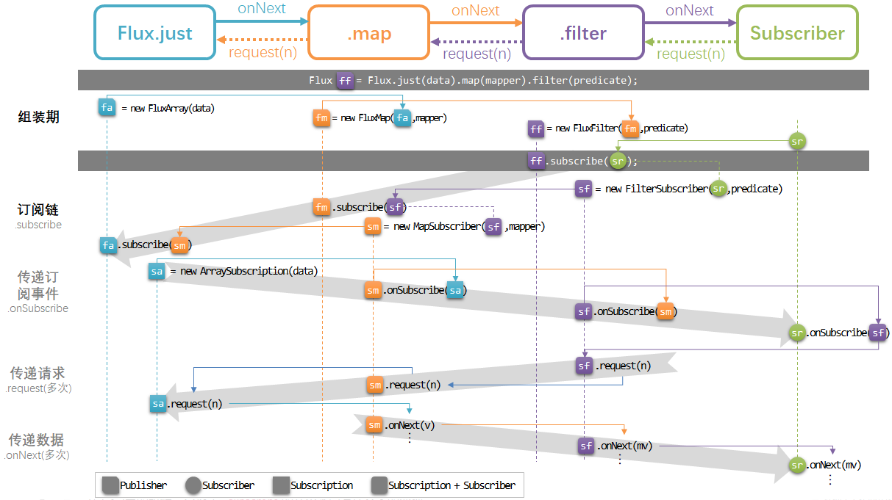

##### 2.1.4 LambdaSubscriber

前面介绍了`.subscribe`的几个不同方法签名的变种： 

```java
subscribe(  Consumer<? super T> consumer) 

subscribe(  @Nullable Consumer<? super T> consumer, 
            Consumer<? super Throwable> errorConsumer) 

subscribe(  @Nullable Consumer<? super T> consumer,
            @Nullable Consumer<? super Throwable> errorConsumer,
            @Nullable Runnable completeConsumer) 

subscribe(  @Nullable Consumer<? super T> consumer,
            @Nullable Consumer<? super Throwable> errorConsumer,
            @Nullable Runnable completeConsumer,
            @Nullable Consumer<? super Subscription> subscriptionConsumer)
```

用起来非常方便，但是响应式流规范中只定义了一个订阅方法`subscribe(Subscriber subscriber)`。实际上，这几个方法最终都是调用的`subscribe(LambdaSubscriber subscriber)`，并通过`LambdaSubscriber`实现了对不同个数参数的组装。如下图所示：

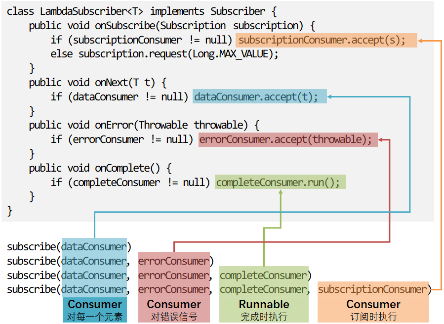

因此， 

```java
 flux.subscribe(System.out::println, System.err::println);
```

调用的是： 

```java
flux.subscribe(new LambdaSubscriber(System.out::println, System.err::println, null, null));
```

#### 2.2 自定义数据流

> https://blog.csdn.net/get_set/article/details/79549401

这一小节介绍如何通过定义相应的事件（`onNext`、`onError`和`onComplete`） 创建一个 Flux 或 Mono。Reactor提供了`generate`、`create`、`push`和`handle`等方法，所有这些方法都使用 sink（池）来生成数据流。 

sink，顾名思义，就是池子，可以想象一下厨房水池的样子。如下图所示： 

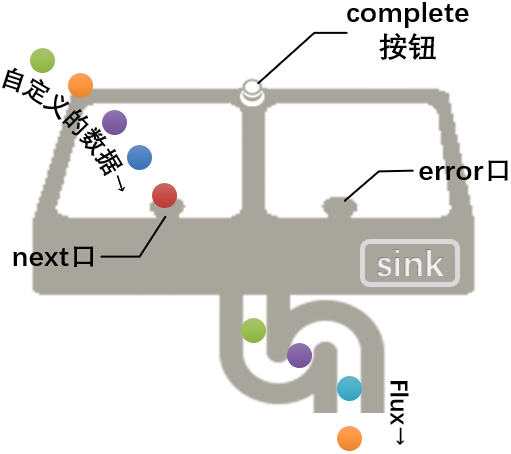

##### 2.2.1 generate

`generate`是一种同步地，逐个地发出数据的方法。因为它提供的sink是一个`SynchronousSink`， 而且其`next()`方法在每次回调的时候最多只能被调用一次。 

`generate`方法有三种签名： 

```java
public static <T> Flux<T> generate(Consumer<SynchronousSink<T>> generator)

public static <T, S> Flux<T> generate(Callable<S> stateSupplier, BiFunction<S, SynchronousSink<T>, S> generator) 

public static <T, S> Flux<T> generate(Callable<S> stateSupplier, BiFunction<S, SynchronousSink<T>, S> generator, Consumer<? super S> stateConsumer)
```

1. 使用SynchronousSink生成数据流 

2. 增加一个伴随状态 

3. 完成后处理 

   分别见eclipse项目的demo

##### 2.2.2 create

`create`是一个更高级的创建Flux的方法，其生成数据流的方式既可以是同步的，也可以是异步的，并且还可以每次发出多个元素。 

`create`用到了`FluxSink`，后者同样提供 next，error 和 complete 等方法。 与generate不同的是，create不需要状态值，另一方面，它可以在回调中触发多个事件（即使事件是发生在未来的某个时间）。 

> create 常用的场景就是将现有的 API 转为响应式，比如监听器的异步方法。 

#### TODO