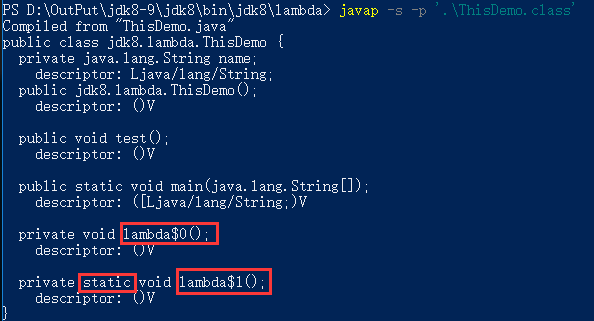
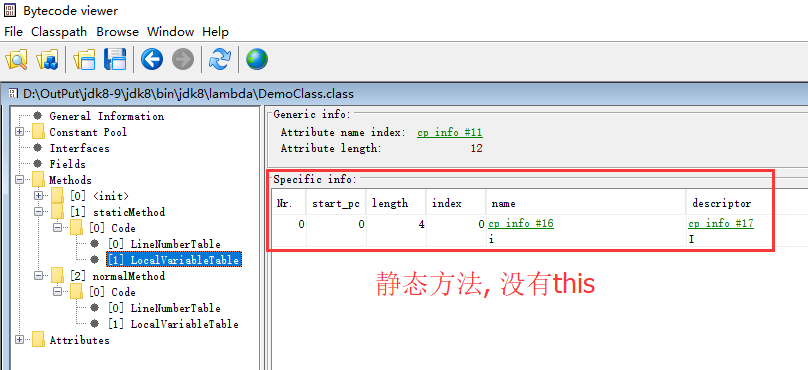
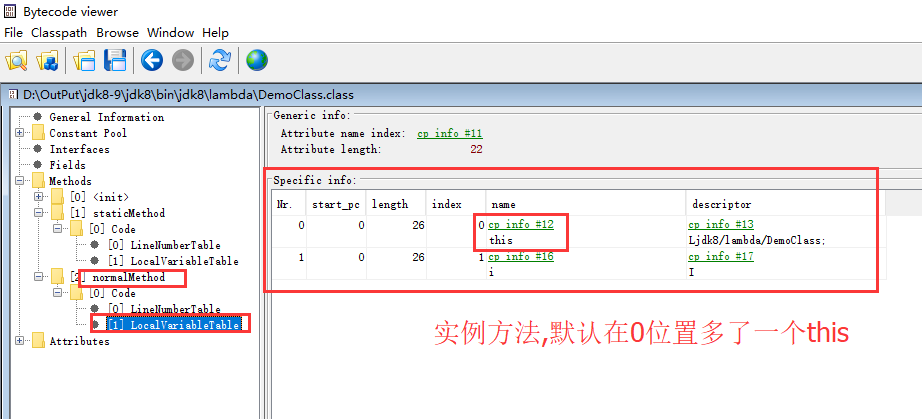
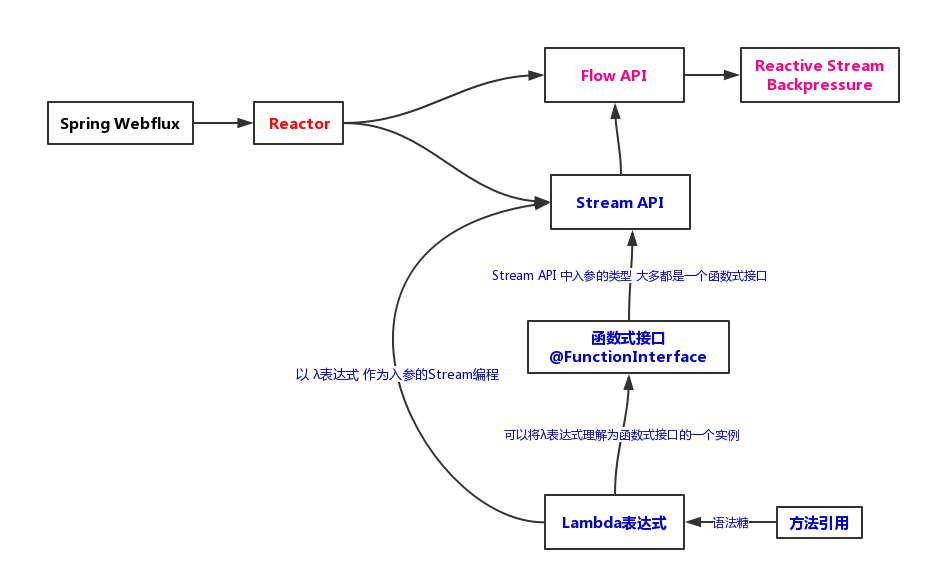

# Spring WebFlux How to Go

> 引用自 晓风轻 的博客，有兴趣的可以去博主的网站去查看
>
> https://www.imooc.com/article/27181

SpringBoot2 已经发布，其中最亮眼的非 WebFlux 响应式编程莫属了！响应式的 WebFlux 可以支持高吞吐量，意味着使用相同的资源可以处理更加多的请求，毫无疑问将会成为未来技术的趋势，是必学的技术！很多人都看过相关的入门教程，但看完之后总觉得很迷糊，知其然不知其所以然，包括我本人也有相同的疑惑。后面在研究和学习中发现，是我的**学习路径不对**，很多基本概念不熟悉，之前公司主打的 JDK 版本还是1.6/1.7，直接跳到运行在 JDK8 上的 WebFlux ，**跨度太大**，迷惑是在所难免的！

在这里我个人推荐的学习途径如下：**先学习 JDK8 的 Lambda 表达式和 Stream 流编程，了解函数式编程的知识点和思想，接着学习 JDK9 的响应式流 Flux，理解响应式流概念，理解背压和实现机制。这二者学好之后，很容易理解 WebFlux 的基石 Reactor，再学习 WebFlux 就水到渠成了！** 

这里我记录了自己的学习之路，列出了每一块的学习重点，除了 API 的知识点学习之外，更加重要的了解底层运行机制和实现原理。对于我个人来说，**学习技术如果不了解原理，知识点需要死记硬背，而了解了底层机制之后，不但不需要死记硬背，还可以把自己的技术点连成面融会贯通，很容易举一反三，知识点也不会忘记，也能和别人扯扯技术的底层实现了**。

> 下面只讲解重点/高级知识和底层原理，入门教程请自行搜索学习

### Lambda 表达式

#### Lambda 表达式中 this 关键字

Lambda 表达式最终会返回一个实现了指定接口的实例，看上去和内部匿名类很像，但有一个**最大的区别就是代码里面的 this ，内部匿名类 this 指向的就是匿名类，而 Lambda 表达式里面的 this 指向当前类**。 

事实上，在经过 javac 编译成 class 文件后可以发现，匿名的内部类也会独立的编译成一个单独的 class 文件；而 Lambda 表达式不会，它会以一个成员方法出现在当前类中，调用invokeMethod 方法就可以调用该 Lambda 方法，所以也可以理解为什么 Lambda 中的 this 指向了当前类。

```java
package jdk8.lambda;

/**
 * lambda表达式的this
 */
public class ThisDemo {
  private String name = "ThisDemo";
  public void test() {
    // 匿名类实现
    new Thread(new Runnable() {
      private String name = "Runnable";
      @Override
      public void run() {
        System.out.println("这里的this指向匿名类:" + this.name);
      }
    }).start();

    // lambda实现
    new Thread(() -> {
      System.out.println("这里的this指向当前的ThisDemo类:" + this.name);
    }).start();
  }

  public static void main(String[] args) {
    ThisDemo demo = new ThisDemo();
    demo.test();
  }
}

运行结果：
这里的this指向匿名类:Runnable
这里的this指向当前的ThisDemo类:ThisDemo
```

##### 实现原理

Lambda 表达式里面，会把 Lambda 表达式在本类中生成一个以 lambda$ + 数字 的方法。**关键点：该方法不一定是 static 的方法，是 static 还是非 static，取决于 Lambda 表达式里面是否引用了 this**。这就是为什么 lambda 表达式里面的 this 指向的是本地，因为它**在本类里面创建了一个方法，然后把 lambda 表达式里面的代码放进去**。

```java
// lambda实现
// 下面会自动生成lambda$0方法,由于使用了this,所以是非static方法
new Thread(() -> {
  System.out.println("这里的this指向当前的ThisDemo类:" + this.name);
}).start();

// lambda实现
// 下面会自动生成lambda$1方法,由于没有使用this,所以是static方法
new Thread(() -> {
  System.out.println("这里没有引用this,生成的lambda1方法是static的");
}).start();
```

上面代码会自动生成2个 lambda$ 方法

使用 javap -s -p 类名， 可以看出一个是 static，一个是非 static 的



这就是为什么 lambda 表达式里面的 this 指向当前类的底层机制！因为**代码就是在本类的一个方法里面执行的**。

额外说一句，自动生成的方法是否带参数取决于 lambda 是否有参数，例子中表达式没有参数（箭头左边是空的），所以自动生成的也没有。

> *这里我们明白了，lambda 表达式虽然能替换匿名内部类，但是lambda和匿名内部类的实现机理是不同的。匿名内部类最终会生成一个额外的类文件，而 lambda 最终成为本类的一个方法。*
>
> *从这个角度来看，也能理解 this 的指向是不同的，由于匿名内部类生成了新的类文件，所以它的 this 就指向了新类；而 lambda 只是本类中的一个方法，所以指向的应该还是本类。*

> lambda 又称为箭头函数，在 JS 中也有箭头函数，那么在 JS 的箭头函数中的 this 又指向哪里呢? 
>
> this 指向于方法执行的上下文，什么又是上下文环境呢?
>
> 上下文就是该方法执行的前后代码关系。 

### 实例方法的方法引用

方法引用有多种，静态方法的方法引用很好理解，但实例对象的方法引用一开始确实让我有点费解，这和静态方法引用由啥区别？看上去很像啊。

```java
class DemoClass {
    /**
     * 这里是一个静态方法
     */
    public static int staticMethod(int i) {
        return i * 2;
    }

    /**
     * 这里是一个实例方法
     */
    public int normalMethod(int i) {
        System.out.println("实例方法可以访问this:" + this);
        return i * 3;
    }
}

public class MethodRefrenceDemo {
    public static void main(String[] args) {
        // 静态方法的方法引用
        IntUnaryOperator methodRefrence1 = DemoClass::staticMethod;
        System.out.println(methodRefrence1.applyAsInt(111));

        DemoClass demo = new DemoClass();

        // 实例方法的方法引用
        IntUnaryOperator methodRefrence2 = demo::normalMethod;
        System.out.println(methodRefrence2.applyAsInt(111));
    }
}
```

这里牵涉到不同的语言里面对 this 的实现方法。我们知道静态方法和实例方法的区别是实例方法有 this，静态方法没有。Java 里面是怎么样实现 this 的呢？

**Java里面在默认把this作为参数，放到实例方法的第一个参数。**

也就是说：

```java
/**
 * 这里是一个实例方法
 */
public int normalMethod(int i) {
    System.out.println("实例方法可以访问this:" + this);
    return i * 2;
}
```

编译之后和下面这样的代码编译之后是一样的！

```java
/**
 * 这里是一个实例方法
 */
public int normalMethod(DemoClass this,int i) {
    System.out.println("实例方法可以访问this:" + this);
    return i * 2;
}
```

**如何证明上面的结论呢？**

**第1个证据，看反编译里面的本地变量表。**

静态方法：



而实例方法：



**第2个证据，下面这样的代码能正确执行**

```java
class DemoClass2{
    /**
     * 这里是一个实例方法, 代码上2个参数
     * 而我们调用的时候只有一个参数
     */
    public int normalMethod(DemoClass2 this,int i) {
        return i * 2;
    }
}

public class MethodRefrenceDemo {
    public static void main(String[] args) {
        DemoClass2 demo2 = new DemoClass2();
        // 代码定义上有2个参数, 第一个参数为this
        // 但实际上调用的时候只需要一个参数
        demo2.normalMethod(1);
       }
}
```

所以，我的理解，Java 里面的所有方法都是静态方法，只是有些方法有 this 变量，有些没有。

所以，**成员方法我们也可以写成静态方法的方法引用**。如下：

```java
public class MethodRefrenceDemo {
    public static void main(String[] args) {
        // 静态方法的方法引用
        IntUnaryOperator methodRefrence1 = DemoClass::staticMethod;
        System.out.println(methodRefrence1.applyAsInt(111));

        DemoClass demo = new DemoClass();

        // 实例方法normalMethod的方法引用
        IntUnaryOperator methodRefrence2 = demo::normalMethod;
        System.out.println(methodRefrence2.applyAsInt(111));

        // 对同一个实例方法normalMethod也可以使用静态引用
        // 代码上normalMethod虽然只有一个参数,但实际上有一个隐含的this函数
        // 所以使用的是2个参数bifunction函数接口
        BiFunction<DemoClass, Integer, Integer> methodRefrence3 = DemoClass::normalMethod;
        System.out.println(methodRefrence3.apply(demo, 111));
    }
}
```

上面代码里面。对同一个实例方法 normalMethod，我们既可以使用实例方法引用（实例 ::方法名），也可以使用静态方法引用（类名 :: 方法名）。

怎么理解 lambda 表达式和方法引用之间的关系呢？可以理解为：方法引用是 lambda 表达式的语法糖，使得 lambda 表达式在一定程度上更加简洁。所以这里可以说，无论 lambda表达式还是方法引用，都是函数式接口的一个实例。所以，如果某个方法需要一个函数式接口实例对象作为入参，我们就可以使用 lambda 表达式或方法引用去实现。

### Lambda 实现惰性求值

惰性求值在 lambda 里面非常重要，也非常有用。

举例，编程规范里面有一条规范，是打印日志前需要判断日志级别（性能要求高的时候）。如下

```java
// 打印日志前需要先判断日志级别
if (logger.isLoggable(Level.FINE)) {
  logger.fine("打印一些日志:" + this);
}
```

为什么要加判断呢？不加判断会有问题呢!  看如下代码：

```java
package jdk8.lambda;

import java.util.concurrent.TimeUnit;
import java.util.logging.Level;
import java.util.logging.Logger;

/**
 * lambda的惰性求值
 */
public class LogDemo {
  private static final Logger logger = Logger
      .getLogger(LogDemo.class.getName());

  @Override
  public String toString() {
    System.out.println("这个方法执行了, 耗时1秒钟");
    try {
      TimeUnit.SECONDS.sleep(1);
    } catch (InterruptedException e) {
    }
    return "LogDemo";
  }

  public void test() {
    // 如果不加判断直接打印, 会有额外多余的开销, 就算最终日志并没有打印
    logger.fine("打印一些日志:" + this);
  }

  public static void main(String[] args) {
    LogDemo demo = new LogDemo();
    demo.test();
  }
}
```

执行代码，发现虽然日志没有打印，但 toString 方法还是执行了，属于多余浪费的开销。

每一个日志打印都加判断，看着很别扭，现在有了 lambda 表达式之后，可以使用lambda的惰性求值，就可以去掉if判断，如下

```java
// 使用lambda表达式的惰性求值,不需要判断日志级别
logger.fine(() -> "打印一些日志:" + this);
```

#### 底层机制

这个现象很好理解，简单讲解一下。就是没有使用 lambda 表达式的时候，相当于

```java
String msg = "打印一些日志:" + this
logger.fine(msg);
```

虽然最后没有打印，但字符串拼接的工作还是执行了。而使用了 lambda 表达式之后，字符串的拼接放到一个函数里面，fine 日志需要打印的时候才去调用这个方法才真正执行！从而实现了惰性求值。

后面我们学习的 JDK8 的 Stream 流编程里面，没有调用**最终操作**的时候，**中间操作**的方法都不会执行，这也是惰性求值。

### Stream 流编程

Stream 编程主要是学习 API 的使用，但前提是学好 lambda，基础好了，看这些方法定义非常简单，要是没有打好基础，你会有很多东西需要记忆。

#### 内部迭代和外部迭代

一般来说，我们之前的编码方法，叫外部迭代，Stream 的写法叫内部迭代。内部迭代代码更加可读更加优雅，关注点是做什么（外部迭代关注是怎么样做），也很容易让我们养成编程小函数的好习惯！这点在编程习惯里面非常重要！看例子：

> 注：内部迭代和外部迭代的关注点是不同的，内部迭代关注做什么，外部迭代关注怎么做。这点与命令式编程和声明式编程相似，命令式编程关注的是怎么去做，然后计算机根据我们的命令一步一步的去执行，声明式关注的是做些什么。接着说，能不能举一个声明式风格的例子呢？SQL，没有什么比 SQL 更加符合声明式了，当我们编写 SQL 语句操作数据库时，我们并没有关注数据库引擎是如何完成这些动作，如： 
>
> `SELECT * FROM book b WHERE b.id > 10 GROUP BY b.category;`
>
> 当我们看到这句 SQL 时，我们知道它是查询 id 大于10的书籍，并且按照书籍分类进行分组，至于数据库引擎是如何做到的，我们并不关心。使用 Stream 编程，就好比是编写 SQL，将上面的 SQL 语句使用 Stream 的方式来写一下：
>
> `list.stream().filter(b -> b.getId>10).groupBy(b -> b.getCategory);`
>
> 至此，我们应该能够明白什么是内部迭代，什么是声明式编程了。
>
> 顺便说一句，虽然 Stream 可以到达 SQL 所有操作的效果，但是完全不建议从数据库中将所有数据都查询出来，再经过 Stream 来处理。

注：外部迭代需要借助于外部的迭代器去完成操作，而内部迭代只需要在自身对象中完成该迭代操作。详情见《Java8函数式编程》一书

```java
import java.util.stream.IntStream;

public class StreamDemo1 {

  public static void main(String[] args) {
    int[] nums = { 1, 2, 3 };
    // 外部迭代
    int sum = 0;
    for (int i : nums) {
      sum += i;
    }
    System.out.println("结果为：" + sum);

    // 使用stream的内部迭代
    // map就是中间操作（返回stream的操作）
    // sum就是终止操作
    int sum2 = IntStream.of(nums).map(StreamDemo1::doubleNum).sum();
    System.out.println("结果为：" + sum2);

    System.out.println("惰性求值就是终止没有调用的情况下，中间操作不会执行");
    IntStream.of(nums).map(StreamDemo1::doubleNum);
  }

  public static int doubleNum(int i) {
    System.out.println("执行了乘以2");
    return i * 2;
  }
}
```

#### 操作类型

操作类型概念要理清楚。有几个维度。

首先分为 **中间操作** 和 **最终操作**，在最终操作没有调用的情况下，所有的中级操作都不会执行。那么那些是中间操作那些是最终操作呢？ 简单来说，返回 Stream 流的就是中间操作，可以继续链式调用下去，不是返回 Stream 的就是最终操作。这点很好理解。

最终操作里面分为 **短路操作** 和 **非短路操作**，短路操作就是 limit/findxxx/xxxMatch 这种，就是找了符合条件的就终止，其他的就是非短路操作。在无限流里面需要调用短路操作，否则像炫迈口香糖一样根本停不下来！

中间操作又分为 **有状态操作** 和 **无状态操作**，怎么样区分呢？ 一开始很多同学需要死记硬背，其实你主要掌握了**状态**这个关键字就不需要死记硬背。**状态就是和其他数据有关系**。我们可以看方法的参数，如果是一个参数的，就是无状态操作，因为只和自己有关，其他的就是有状态操作。如 map/filter 方法，只有一个参数就是自己，就是无状态操作；而distinct/sorted 就是有状态操作，因为去重和排序都需要和其他数据比较，理解了这点，就不需要死记硬背了！

为什么要知道有状态和无状态操作呢？在多个操作的时候，我们需要把无状态操作写在一起，有状态操作放到最后，这样效率会更加高。

- 运行机制

我们可以通过下面的代码来理解 Stream 的运行机制

```java
package stream;

import java.util.Random;
import java.util.concurrent.TimeUnit;
import java.util.stream.Stream;

/**
 * 验证stream运行机制
 * 
 * 1. 所有操作是链式调用, 一个元素只迭代一次 
 * 2. 每一个中间操作返回一个新的流. 流里面有一个属性sourceStage 
 *     指向同一个 地方,就是Head 
 * 3. Head->nextStage->nextStage->... -> null
 * 4. 有状态操作会把无状态操作阶段,单独处理
 * 5. 并行环境下, 有状态的中间操作不一定能并行操作.
 * 
 * 6. parallel/ sequetial 这2个操作也是中间操作(也是返回stream)
 *     但是他们不创建流, 他们只修改 Head的并行标志
 *
 */
public class RunStream {

  public static void main(String[] args) {
    Random random = new Random();
    // 随机产生数据
    Stream<Integer> stream = Stream.generate(() -> random.nextInt())
        // 产生500个 ( 无限流需要短路操作. )
        .limit(500)
        // 第1个无状态操作
        .peek(s -> print("peek: " + s))
        // 第2个无状态操作
        .filter(s -> {
          print("filter: " + s);
          return s > 1000000;
        })
        // 有状态操作
        .sorted((i1, i2) -> {
          print("排序: " + i1 + ", " + i2);
          return i1.compareTo(i2);
        })
        // 又一个无状态操作
        .peek(s -> {
          print("peek2: " + s);
        }).parallel();

    // 终止操作
    stream.count();
  }

  /**
   * 打印日志并sleep 5 毫秒
   * 
   * @param s
   */
  public static void print(String s) {
    // System.out.println(s);
    // 带线程名(测试并行情况)
    System.out.println(Thread.currentThread().getName() + " > " + s);
    try {
      TimeUnit.MILLISECONDS.sleep(5);
    } catch (InterruptedException e) {
    }
  }
}
```

大家自己测试一下代码，能发现 Stream 的调用方法，就像现实中的流水线一样，一个元素只会迭代一次，但如果中间有无状态操作，前后的操作会单独处理（元素就会被多次迭代）。

### JDK9 响应式流

Reactive Stream，也就是 Flow。其实和 JDK8 的 Stream 没有一点关系。说白了就一个发布-订阅模式，一共只有4个接口，3个对象，非常简单清晰。写一个入门例子就可以掌握。

```java
package jdk9;

import java.util.concurrent.Flow.Processor;
import java.util.concurrent.Flow.Subscriber;
import java.util.concurrent.Flow.Subscription;
import java.util.concurrent.SubmissionPublisher;

/**
 * 带 processor 的 flow demo
 */

/**
 * Processor, 需要继承SubmissionPublisher并实现Processor接口
 * 
 * 输入源数据 integer, 过滤掉小于0的, 然后转换成字符串发布出去
 */
class MyProcessor extends SubmissionPublisher<String>
    implements Processor<Integer, String> {

  private Subscription subscription;

  @Override
  public void onSubscribe(Subscription subscription) {
    // 保存订阅关系, 需要用它来给发布者响应
    this.subscription = subscription;

    // 请求一个数据
    this.subscription.request(1);
  }

  @Override
  public void onNext(Integer item) {
    // 接受到一个数据, 处理
    System.out.println("处理器接受到数据: " + item);

    // 过滤掉小于0的, 然后发布出去
    if (item > 0) {
      this.submit("转换后的数据:" + item);
    }

    // 处理完调用request再请求一个数据
    this.subscription.request(1);

    // 或者 已经达到了目标, 调用cancel告诉发布者不再接受数据了
    // this.subscription.cancel();
  }

  @Override
  public void onError(Throwable throwable) {
    // 出现了异常(例如处理数据的时候产生了异常)
    throwable.printStackTrace();

    // 我们可以告诉发布者, 后面不接受数据了
    this.subscription.cancel();
  }

  @Override
  public void onComplete() {
    // 全部数据处理完了(发布者关闭了)
    System.out.println("处理器处理完了!");
    // 关闭发布者
    this.close();
  }
}

public class FlowDemo2 {

  public static void main(String[] args) throws Exception {
    // 1. 定义发布者, 发布的数据类型是 Integer
    // 直接使用jdk自带的SubmissionPublisher
    SubmissionPublisher<Integer> publiser = new SubmissionPublisher<Integer>();

    // 2. 定义处理器, 对数据进行过滤, 并转换为String类型
    MyProcessor processor = new MyProcessor();

    // 3. 发布者 和 处理器 建立订阅关系
    publiser.subscribe(processor);

    // 4. 定义最终订阅者, 消费 String 类型数据
    Subscriber<String> subscriber = new Subscriber<String>() {

      private Subscription subscription;

      @Override
      public void onSubscribe(Subscription subscription) {
        // 保存订阅关系, 需要用它来给发布者响应
        this.subscription = subscription;

        // 请求一个数据
        this.subscription.request(1);
      }

      @Override
      public void onNext(String item) {
        // 接受到一个数据, 处理
        System.out.println("接受到数据: " + item);

        // 处理完调用request再请求一个数据
        this.subscription.request(1);

        // 或者 已经达到了目标, 调用cancel告诉发布者不再接受数据了
        // this.subscription.cancel();
      }

      @Override
      public void onError(Throwable throwable) {
        // 出现了异常(例如处理数据的时候产生了异常)
        throwable.printStackTrace();

        // 我们可以告诉发布者, 后面不接受数据了
        this.subscription.cancel();
      }

      @Override
      public void onComplete() {
        // 全部数据处理完了(发布者关闭了)
        System.out.println("处理完了!");
      }

    };

    // 5. 处理器 和 最终订阅者 建立订阅关系
    processor.subscribe(subscriber);

    // 6. 生产数据, 并发布
    // 这里忽略数据生产过程
    publiser.submit(-111);
    publiser.submit(111);

    // 7. 结束后 关闭发布者
    // 正式环境 应该放 finally 或者使用 try-resouce 确保关闭
    publiser.close();

    // 主线程延迟停止, 否则数据没有消费就退出
    Thread.currentThread().join(1000);
  }
}
```

#### 背压

背压依我的理解来说，是指订阅者能和发布者交互（通过代码里面的调用 request 和 cancel 方法交互），可以调节发布者发布数据的速率，解决把订阅者压垮的问题。关键在于上面例子里面的订阅关系 Subscription 这个接口，它有 request 和 cancel  2个方法，用于通知发布者需要数据和通知发布者不再接受数据。

我们重点理解背压在 JDK9 里面是如何实现的。关键在于**发布者 Publisher 的实现类SubmissionPublisher 的 submit 方法是 block 方法**。订阅者会有一个缓冲池，默认为Flow.defaultBufferSize() = 256。当订阅者的缓冲池满了之后，发布者调用submit方法发布数据就会被阻塞，发布者就会停（慢）下来；订阅者消费了数据之后（调用Subscription.request 方法），缓冲池有位置了，submit 方法就会继续执行下去，就是通过这样的机制，实现了调节发布者发布数据的速率，消费得快，生成就快，消费得慢，发布者就会被阻塞，当然就会慢下来了。

怎么样实现发布者和多个订阅者之间的阻塞和同步呢？使用的 JDK7 的 Fork/Join 的ManagedBlocker，有兴趣的请自己查找相关资料。

>  Fork/Join 框架是并发任务处理的底层，其实现原理值得我们学习。它的设计理念很单纯，就是分治的思想，“大事化小，小事化了”。当小问题都解决了，大问题自然也就迎刃而解了。分治的思想比计算机出现早得多的多，是人类处理问题过程中智慧的结晶。大数据平台中的计算框架 Map/Reduce 也是基于分治的思想，将任务分发到集群上的多个节点上，当每个节点都处理完后，合并计算的结果，就得到了最终的结果。

### Reactor

Spring WebFlux 是基于 Reactor 来实现响应式的。那么 Reactor 是什么呢？

我是这样理解的 **Reactor = JDK8 的 Stream + JDK9 的 Flow 响应式流**。

理解了这句话，reactor就很容易掌握。 reactor 里面 Flux 和 Mono 就是 Stream，它的最终操作就是 subscribe/block 2种。reactor 里面说的不订阅将什么也不会执行就是我们最开始学习的惰性求值。 

我们来看一段代码，理解一下：

```java
package com.imooc;

import java.util.concurrent.TimeUnit;

import org.reactivestreams.Subscriber;
import org.reactivestreams.Subscription;

import reactor.core.publisher.Flux;

public class ReactorDemo {

  public static void main(String[] args) {
    // reactor = jdk8 stream + jdk9 reactive stream
    // Mono 0-1个元素
    // Flux 0-N个元素
    String[] strs = { "1", "2", "3" };

    // 2. 定义订阅者
    Subscriber<Integer> subscriber = new Subscriber<Integer>() {

      private Subscription subscription;

      @Override
      public void onSubscribe(Subscription subscription) {
        // 保存订阅关系, 需要用它来给发布者响应
        this.subscription = subscription;

        // 请求一个数据
        this.subscription.request(1);
      }

      @Override
      public void onNext(Integer item) {
        // 接受到一个数据, 处理
        System.out.println("接受到数据: " + item);

        try {
          TimeUnit.SECONDS.sleep(3);
        } catch (InterruptedException e) {
          e.printStackTrace();
        }

        // 处理完调用request再请求一个数据
        this.subscription.request(1);

        // 或者 已经达到了目标, 调用cancel告诉发布者不再接受数据了
        // this.subscription.cancel();
      }

      @Override
      public void onError(Throwable throwable) {
        // 出现了异常(例如处理数据的时候产生了异常)
        throwable.printStackTrace();

        // 我们可以告诉发布者, 后面不接受数据了
        this.subscription.cancel();
      }

      @Override
      public void onComplete() {
        // 全部数据处理完了(发布者关闭了)
        System.out.println("处理完了!");
      }

    };

    // 这里就是jdk8的stream
    Flux.fromArray(strs).map(s -> Integer.parseInt(s))
    // 最终操作
    // 这里就是jdk9的reactive stream
    .subscribe(subscriber);
  }
}
```

上面的例子里面，我们可以把 JDK9 里面 flowdemo 的订阅者代码原封不动的 copy 过来，直接就可以用在 reactor 的 subscribe 方法上。订阅就是相当于调用了 stream 的最终操作。有了 Reactor = JDK8 Stream + JDK9 Reactive Stream 概念后，在掌握了 JDK8 的Stream 和 JDK9 的 Flow 之后，reactor也不难掌握。

### Spring5 WebFlux

上面的基础和原理掌握之后，学习 WebFlux 就水到渠成了！**WebFlux的关键是自己编写的代码里面返回流（Flux/Mono），Spring 框架来负责处理订阅。** Spring 框架提供2种开发模式来编写响应式代码，使用 MVC 之前的注解模式和使用 router function 模式，都需要我们的代码返回流，Spring的响应式数据库 Spring Sata JPA，如使用 mongodb，也是返回流，订阅都需要交给框架，自己不能订阅。而编写响应式代码之前，我们还需要了解2个重要的概念，就是异步 Servlet 和 SSE。 

#### 异步 Servlet

学习异步 servlet 我们最重要的**了解同步 Servlet 阻塞了什么？为什么需要异步 Servlet？异步 servlet 能支持高吞吐量的原理是什么？**

Servlet 容器（如 Tomcat）里面，每处理一个请求会占用一个线程，同步 servlet 里面，业务代码处理多久，servlet 容器的线程就会等（阻塞）多久，而 servlet 容器的线程是有上限的，当请求多的时候 servlet 容器线程就会全部用完，就无法再处理请求（这个时候请求可能排队也可能丢弃，得看如何配置），就会限制了应用的吞吐量！

而异步 serlvet 里面，servlet 容器的线程不会傻等业务代码处理完毕，而是直接返回（继续处理其他请求），给业务代码一个回调函数（asyncContext.complete()），业务代码处理完了再通知我！这样就可以使用少量的线程处理更加高的请求，从而实现高吞吐量！

我们看示例代码：

```java
import java.io.IOException;
import java.util.concurrent.CompletableFuture;
import java.util.concurrent.TimeUnit;

import javax.servlet.AsyncContext;
import javax.servlet.ServletException;
import javax.servlet.ServletRequest;
import javax.servlet.ServletResponse;
import javax.servlet.annotation.WebServlet;
import javax.servlet.http.HttpServlet;
import javax.servlet.http.HttpServletRequest;
import javax.servlet.http.HttpServletResponse;

/**
 * Servlet implementation class AsyncServlet
 */
@WebServlet(asyncSupported = true, urlPatterns = { "/AsyncServlet" })
public class AsyncServlet extends HttpServlet {
  private static final long serialVersionUID = 1L;

  /**
   * @see HttpServlet#HttpServlet()
   */
  public AsyncServlet() {
    super();
  }

  /**
   * @see HttpServlet#doGet(HttpServletRequest request, 
   *	HttpServletResponse response)
   */
  protected void doGet(HttpServletRequest request,
      HttpServletResponse response) throws ServletException, IOException {
    long t1 = System.currentTimeMillis();

    // 开启异步
    AsyncContext asyncContext = request.startAsync();

    // 执行业务代码
    CompletableFuture.runAsync(() -> doSomeThing(asyncContext,
        asyncContext.getRequest(), asyncContext.getResponse()));

    System.out.println("async use:" + (System.currentTimeMillis() - t1));
  }

  private void doSomeThing(AsyncContext asyncContext,
      ServletRequest servletRequest, ServletResponse servletResponse) {

    // 模拟耗时操作
    try {
      TimeUnit.SECONDS.sleep(5);
    } catch (InterruptedException e) {
    }

    //
    try {
      servletResponse.getWriter().append("done");
    } catch (IOException e) {
      e.printStackTrace();
    }

    // 业务代码处理完毕, 通知结束  ***最终要的是这个回调方法***
    asyncContext.complete();
  }

  /**
   * @see HttpServlet#doPost(HttpServletRequest request, 
   *	HttpServletResponse response)
   */
  protected void doPost(HttpServletRequest request,
      HttpServletResponse response) throws ServletException, IOException {
    doGet(request, response);
  }
}
```

大家可以运行上面代码，业务代码花了5秒，但 servlet 容器的线程几乎没有任何耗时。而如果是同步 servlet 的，线程就会傻等5秒，这5秒内这个线程只处理了这一个请求。

#### SSE (Server-sent event)

响应式流里面，可以多次返回数据（其实和响应式没有关系），使用的技术就是 H5 的SSE。我们学习技术，API的使用只是最初级也是最简单的，更加重要的是需要知其然并知其所以然，否则你只能死记硬背不用就忘！我们不满足在 Spring 里面能实现 SSE 效果，更加需要知道 Spring 是如何做到的。其实 SSE 很简单，我们花一点点时间就可以掌握，我们在纯 servlet 环境里面实现。我们看代码，这里一个最简单的示例。

```java
import java.io.IOException;
import java.util.concurrent.TimeUnit;

import javax.servlet.ServletException;
import javax.servlet.annotation.WebServlet;
import javax.servlet.http.HttpServlet;
import javax.servlet.http.HttpServletRequest;
import javax.servlet.http.HttpServletResponse;

/**
 * Servlet implementation class SSE
 */
@WebServlet("/SSE")
public class SSE extends HttpServlet {
  private static final long serialVersionUID = 1L;

  public SSE() {
    super();
  }
    
  protected void doGet(HttpServletRequest request,
      HttpServletResponse response) throws ServletException, IOException {
    response.setContentType("text/event-stream");
    response.setCharacterEncoding("utf-8");

    for (int i = 0; i < 5; i++) {
      // 指定事件标识
      response.getWriter().write("event:me");
      // 格式: data: + 数据 + 2个回车
      response.getWriter().write("data:" + i + "");
      response.getWriter().flush();

      try {
        TimeUnit.SECONDS.sleep(1);
      } catch (InterruptedException e) {
      }
    }

  }

  protected void doPost(HttpServletRequest request,
      HttpServletResponse response) throws ServletException, IOException {
    doGet(request, response);
  }
}
```

关键是 ContentType 是 "text/event-stream"，然后返回的数据有固定的要求格式即可。


**结束语**

经过上面的一步一个脚印的学习，我们的基础已经打牢，障碍已经扫清，现在可以进入轻松愉快的 Spring Flux 学习之旅了！Enjoy！


---

后面是我自己学习过程中，画的一个技术路线图，或许有用



